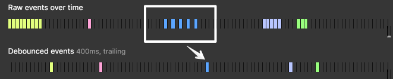

# Функции декораторы, оператор три точки, call, apply

# План занятия

1. Декоратор логгер
2. spread, rest, destructuring
3. Кэширующий декоратор
4. Передача контекста (call, apply)
5. Декоратор шпион
6. Декоратор отложенного вызова
7. Тормозящий декоратор

## Функции высшего порядка (High order function)

> HOF - Функция, принимающая в качестве аргументов другие функции или возвращающая другую функцию в качестве результата.

Мы уже знакомы с функциями, которые манипулирует переменными в замыкании, при этом доступа к самой переменной извне нет, кроме как с помощью возвращенных функций.

Также многие методы массива, такие как map, filter являются функциями высшего порядка, так как принимают функции в качестве аргументов.

Крайне распространенный и полезный паттерн, которым надо уметь пользоваться

## Декораторы

Декоратор – это обёртка вокруг функции, которая изменяет поведение последней. Основная работа по-прежнему выполняется функцией.

Декораторы можно рассматривать как «дополнительные возможности» или «аспекты», которые можно добавить в функцию. Мы можем добавить один или несколько декораторов. И всё это без изменения кода оригинальной функции.

## Logger

Примером простого декоратора можно считать Logger, который выводит список переданных аргументов.

Представим, что у нас есть несколько простых функций

```js
const add = (a, b) => a + b;
const mult = (a, b, c) => a * b * c;
```

Тогда декоратор Logger мог бы выглядеть следующим образом:

```js
function decorator(func) {
  function wrapper(...args) {
    // (1)
    console.log("Аргументы: " + args); //(2)
    return func(...args); // (3)
  }
  return wrapper;
}
const upgradedAdd = decorator(add);
const upgradedMult = decorator(mult);
let res1 = upgradedAdd(10, 20); // "Аргументы: 10,20"
let res2 = upgradedMult(2, 3, 5); // "Аргументы: 10,20"
```

## Объяснение

Смотрите, что происходит:

1. Декоратор принимает на вход функцию.
2. При этом создает новую функцию wrapper(обертка) и возвращает её (не вызывает!).
   Это можно сделать и в одну строчку - `return function () { ... }`
3. Эта функция при исполнении выводит список аргументов (2)
4. Вызывает исходную функцию и возвращает результат её работы.

Обратите внимание на ...args(1). Это rest параметры - все параметры переданные в функцию в виде массива.
В строчке (3) ...args это spread оператор.

Рест параметры и спред оператор используются в современной разработке исключительно часто.

## Spread оператор - пример:

```js
const mid = [3, 4];
const arr1 = [1, 2, mid, 5, 6]; //[1, 2, [3, 4], 5, 6]
const arr2 = [1, 2, ...mid, 5, 6]; //[1, 2, 3, 4, 5, 6]
```

Здесь оператор "три точки" превращает массив mid в последовательный набор аргументов.

## Деструктурирующее присваивание

Также очень полезная и широко применяемая возможность - деструктурирующее присваивание
Пример деструктуризации массива:

```js
const arr = ["Vasily", 33, "Moscow", "Junior"];

const [name, age] = arr; // name = Vasily, age = 33
const [name, , city] = arr; // name = Vasily, city = Moscow
const [name, ...rest] = arr; // name = Vasily, rest = [33, 'Moscow', 'Junior ']
```

Здесь ...rest - рест параметр. Еще одно применение оператора "три точки".

## Пример деструктуризации объекта

```js
const obj = { name: "Vasily", age: 33, city: "Moscow", position: "Junior" };
const { name, age } = obj; // name = Vasily, age = 33
const { name, ...rest }; // name = Vasily, rest = {age:33, city:'Moscow', position: 'Junior'}
```

Подробнее про деструктуризацию можно прочитать [тут](https://learn.javascript.ru/destructuring-assignment)

## Мемоизация

Часто возникает задача сделать так, чтобы функция кэшировала результат своего выполнения.

Это можно реализовать используя внешние переменные:

```js
let cache = {};
function add(a, b) {
  const hash = a + "," + b;
  // Хэш нужен для однозначного сопоставления переменных некоторому ключу
  if (hash in cache) {
    console.log("Из кэша: " + cache[hash]);
  } else {
    let result = a + b;
    cache[hash] = result;
    console.log("Вычисляем: " + result);
  }
}

add(1, 5); // вычисляем 6
add(1, 5); // из кэша 6
add(10, 200); // вычисляем 210
add(1, 5); // из кэша 6
```

## Хэш функция

Так как мы помещаем кэшированные результаты в объект, нам необходимо, чтобы было однозначное соответствие между набором параметров и ключом.

В данном случае мы используем простое преобразование, которое пару `(a,b)` переводит в строку `"a,b"`. В более сложных случаях могут потребоваться другие функции хеширования.

## Кэширующий декоратор

Как сделать декорирование универсальным? Напишем функцию декоратор использую подход logger за основу.

```js
function decorator(func) {
  let cache = {};
  function wrapper(...args) {
    const hash = args[0] + "," + args[1];
    if (hash in cache) {
      console.log("Из кэша: " + cache[hash]);
    } else {
      let result = func(...args);
      cache[hash] = result;
      console.log("Вычисляем: " + result);
    }
  }
  return wrapper;
}
```

## Использование

```js
const add = (a, b) => a + b;

const memoizedAdd = decorator(add);
memoizedAdd(10, 51); // Вычисляем 61
memoizedAdd(10, 51); // Из кэша 61
```

## А если функция - метод объекта.

Например

```js
let computer = {
  text: "Результат",
  add(a, b) {
    let c = a + b;
    return this.text + " " + c; // (1)
  },
};
```

И мы захотим использовать мемоизацию

```js
computer.add = decorator(computer.add);
computer.add(1, 2);
```

Результат:
"Вычисляем"
NaN

## Объяснение

Ошибка возникает в строке (1). Функция пытается получить доступ к this.text и завершается с ошибкой. Видите почему?

Причина в том, что в строке `let result = func(...args); ` декоратор вызывает оригинальную функцию как func(...args), и она в данном случае получает this = window.

Т.е. декоратор передаёт вызов оригинальному методу, но без контекста. Следовательно – ошибка.

## Передача контекста

## func.call()

Существует специальный встроенный метод `func.call(context, …args)`, который позволяет вызывать функцию, явно устанавливая контекст(this).

Он запускает функцию `func`, используя первый аргумент как её контекст `this`, а последующие – как её аргументы.

```js
func(...args);
func.call(obj, 51, 10);
func.call(obj, ...args);
```

func вызывается с аргументами (например) `...args = 51, 10` и this равным obj.

## Исправим декоратор

```js
function decorator(func) {
  let cache = {};
  function wrapper(...args) {
    const hash = "a" + args[0] + "b" + args[1];
    if (hash in cache) {
      console.log("Из кэша: " + cache[hash]);
    } else {
      let result = func.call(this, ...args); //(Изменения тут)
      cache[hash] = result;
      console.log("Вычисляем: " + result);
    }
  }
  return wrapper;
}

computer.add = decorator(computer.add);
computer.add(1, 2); // Вычисляем  3
computer.add(1, 2); // Из кэша 3
```

## Что происходит

Теперь всё в порядке.

Чтобы всё было понятно, давайте посмотрим глубже, как передаётся this:

После декорации computer.add становится обёрткой `function wrapper(...args) { ... }`.
Так что при выполнении `computer.add(1, 2)` обёртка получает 1 и 2 в качестве аргументов и this=computer (так как это объект перед точкой).
Внутри обёртки, если результат ещё не кеширован, func.call(this, x) передаёт текущий this (=computer) и текущие аргументы в оригинальную функцию.

## Еще пример call

```js
function getAge() {
  console.log(this.age);
}

let user1 = { age: 18 };
let user2 = { age: 33 };

// используем 'call' для передачи различных объектов в качестве 'this'
getAge.call(user1); // 18
getAge.call(user2); // 33
```

в приведённом коде мы вызываем getAge в контексте различных объектов: getAge.call(user1) запускает getAge, передавая this=user1, а следующая строка устанавливает this=user2

## Метод apply

Ранее мы использовали func.call(this, ...arguments)
Вместо этого мы могли бы написать func.apply(this, arguments).

Синтаксис встроенного метода [func.apply](https://developer.mozilla.org/ru/docs/Web/JavaScript/Reference/Global_Objects/Function/apply)

```js
func.call(context, ...args); // передаёт массив как список с оператором расширения
func.apply(context, args); // тот же эффект
```

Выполняем func, устанавливая this=context и принимая в качестве списка аргументов псевдомассив args.

Есть только одна небольшая разница:
Оператор расширения `...` позволяет передавать перебираемый объект args в виде списка в call, а apply принимает только псевдомассив args.

А если у нас объект, который и то, и другое, например, реальный массив, то технически мы могли бы использовать любой метод

## Улучшим хэширующую функцию

А что, если аргументов много?
Попробуем сделать хэширующую функцию более универсальной

```js
const calculation = (a, b, c, d) => a ** 2 + b ** 2 + c ** 2 + d ** 2;

function decorator(func) {
  let cache = {};
  function wrapper(...args) {
    const hash = args.join(","); // hash = "a,b,c,d"
    if (hash in cache) {
      console.log("Из кэша: " + cache[hash]);
    } else {
      let result = func.call(this, ...args); //(Изменения тут)
      cache[hash] = result;
      console.log("Вычисляем: " + result);
    }
  }
  return wrapper;
}
let cachedCalculation = decorator(calculation);
cachedCalculation(3, 2, 3, 4); // Вычисляем: 38
cachedCalculation(3, 2, 3, 4); // Из кэша: 38;
}
```

## Декоратор шпион

Мы хотим создать декоратор, который будет сохранять список всех вызовов функции (аргументы) в свойстве `history` функции обертки.

```js
const add = (a, b) => a + b;

function spyDecorator(func) {
  function wrapper(...args) {
    wrapper.history.push(args);
    return func.call(this, ...args);
  }

  wrapper.history = [];

  return wrapper;
}

const upgradedAdd = spyDecorator(add);

upgradedAdd(100, 200);
upgradedAdd(1, 1);

console.log(upgradedAdd.history); // [100,200] , [1,1]
```

## Задерживающий декоратор

Декоратор создаёт функцию, которая выполняется с задержкой

```js
const add = (a, b) => a + b;

function decorator(f, ms) {
  return function (...args) {
    setTimeout(function () {
      f.apply(this, args);
    }, ms);
  };
}
const delayedAdd = decorator(add, 2000);
delayedAdd(51, 10); //61
```

Функция `setTimeout(func,ms)` выполняет переданную внутрь функцию `func` через `ms` миллисекунд. Подробнее об этом будет на лекции "Асинхронность".

## Проблема setTimeout и метод объекта

А что если применить декоратор к методу объекта?

```js
function decorator(f, ms) {
  return function (...args) {
    setTimeout(function () {
      f.apply(this, args); //(1)
    }, ms);
  };
}

let computer = {
  text: "Результат: ",
  add(a, b) {
    console.log(this.text + (a + b)); // (2)
  },
};

const delayedAdd = decorator(computer.add, 2000);
delayedAdd(51, 10);
```

Чему будет равен `this` в строчке (1) и соответственно `this.text` в строчке (2)?

Вывод: `"undefined 61"`

## Объяснение

Через 2 секунды `setTimeout` вызовет функцию, которая передана первым аргументом:

```js
function () { f.apply(this, args); }
```

Как будет вызвана эта функция? Как метод объекта или просто как функция?
В нашем случае `f = computer.add`. Важно, не чем является `f`, а как она вызвана.

Тогда чему будет равен `this` внутри вызываемой функции?

## Решение - простой способ сохранить this.

```js
function decorator(f, ms) {
  return function (...args) {
    let savedThis = this; //(2)
    console.log(savedThis);
    setTimeout(function () {
      f.apply(savedThis, args); //(3)
    }, ms);
  };
}
computer.add = decorator(computer.add, 2000);
computer.add(51, 10); //(1)  // Результат: 61
```

1. Вызываем функцию add как метод объекта. (внутри this = computer)
2. Сохраняем savedThis = computer
3. Вызываем f (исходная функция) с правильным this

## Декоратор отложенного вызова Debounce

Декоратор преобразовывает функцию так, что она будет выполнена только тогда, когда после последней попытки вызова прошло определённое время. Задержка начинает заново отсчитываться с каждой новой попыткой вызова. Удобно при обращении к api, например когда пользователь вбивает текст поиска в инпут. Данные будут отправлены когда возникнет пауза.

[](debounce.png)
На картинке сверху вызовы функции, снизу работа функции.

## Код

```js
const showCoords = (x, y) => console.log(`Клик:(${x},${y})`);

function decorator(f, ms) {
  let timeout;
  return function (...args) {
    clearTimeout(timeout);
    timeout = setTimeout(() => {
      f.apply(this, args);
      console.timeEnd("time"); //(2)
    }, ms);
  };
}

const delayedFunc = decorator(showCoords, 1000);
console.time("time"); //(1)
setTimeout(() => delayedFunc(10, 5));
setTimeout(() => delayedFunc(20, 10), 980);
setTimeout(() => delayedFunc(30, 30), 980);
// "Клик: 30,30" через 2 секунды (примерно)
```

## Объяснение

При каждом вызове функция удаляет старый таймер и создаёт новый, который сработает, если функция не будет вызвана еще раз.
Функции `console.time` и `console.timeEnd` позволяют логировать время.

## Тормозящий (throttle) декоратор

Пусть у нас есть некоторое действие, например перемещение персонажа в онлайн игре, и мы хотим отправлять информацию об этом действии на сервер (но не слишком часто, чтобы не спамить).

[](throttle.png)

Несмотря на то что персонаж двигается часто, мы отправляем его координаты не чаще чем раз в сколько то `ms`

Нам нужно сохранять аргументы каждого вызова,так как мы не знаем, какой будет последним, до момента отправки.
Также хотелось бы сохранить контекст, если мы будем применять декоратор к методу объекта.

Это наиболее комплексное решение, которое можно использовать как шаблон для остальных.

## Код

```js
function decorator(func, ms) {
  let isThrottled = false, //(1)
    savedArgs,
    savedThis;

  return function (...args) {
    savedArgs = args; //(2)
    savedThis = this;

    if (isThrottled) {
      return; //(3)
    }

    func.apply(this, savedArgs);//(4)
    isThrottled = true;

    setTimeout(()=> {
        isThrottled = false; //(5)
        func.apply(savedThis, savedArgs);
      }
    }, ms);
  };
}
```

## Объяснение

1. Создаем переменные в лексическом окружении, куда будем сохранять последние аргументы, контекст и состояние (задержка активна или нет).
2. На каждом вызове обновляем контекст и аргументы (чтобы взять последние)
3. Если функция на задержке - просто выходим.
4. Иначе, во первых выполняем функцию и взводим флаг.
5. Затем ставим таймер, чтобы очистить флаг через `ms` и выполнить функцию в конце с последними сохраненными аргументами и контекстом.

## Пример

Будем "тормозить" очень простую функцию, которая выводит в консоль переданный аргумент и время (для отладки).

```js
function func(a) {
  console.log(a);
  console.timeLog();
}

let throttled = decorator(func, 1000);

console.time();
throttled(1); // (задержки нет) 1
throttled(2); // (задержка, 1000 мс ещё не прошло)
throttled(3); // (задержка)
setTimeout(() => throttled(5), 900); //(задержка)
// выведет 5 (последний аргумент) примерно через 1000мс
setTimeout(() => throttled(6), 1100); // (задержки нет) 6
setTimeout(() => throttled(7), 2000); // (задержка)
// выведет 7 (последний аргумент) примерно через 1000мс с момента запуска throttled(6)
```

## Чему мы научились?

1. Познакомились с концепцией декораторов и научились их писать.
2. Узнали про деструктуризацию, spread оператор и rest параметры. Научились деструктуризовать массивы и объекты. Научились использовать rest параметр для получения всех аргументов функции.
3. Научились задавать контекст вызова с помощью apply и call.
